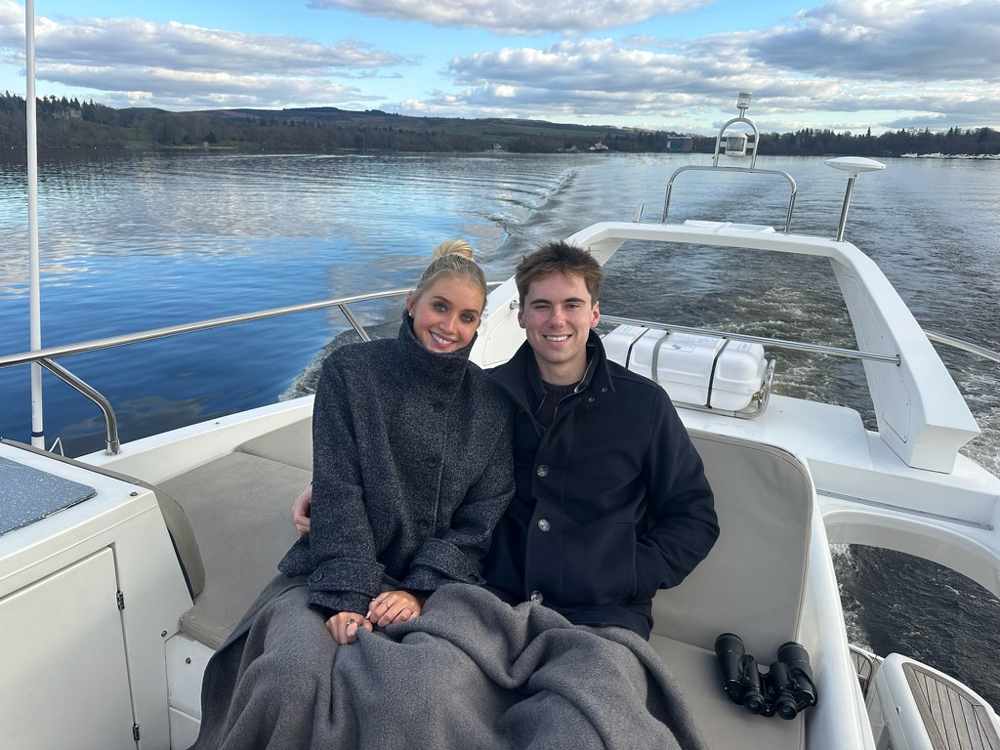

As a kid, I once secretly hoarded spoons from the kitchen and stashed them in my room not for mischief, but because I was worried we might run out one day. I think this highlights how I think: I like anticipating problems before they show up and quietly solving them in advance. That same instinct to plan, build, and prepare for the unknown still drives how I approach everything.

# My Background

I grew up in **Menlo Park, California** with a brother, sister, two loving parents, and a golden retriever, Cooper. I  feel incredibly lucky to have been raised in a home filled with love, support, and the kind of values that have shaped who I am today.

# Education

I’m currently pursuing a **B.A. in Computer Science and Economics** at the University of Notre Dame. Before college, I took a gap year through **EF Education First**, traveling through 13 European countries in a language immersion and internship program that expanded both my worldview and my Spotify playlist.

# Interests & Hobbies

In my free time, I love competing — whether it’s playing poker, euchre, or other card games, shooting hoops, or playing (more often than not losing) to my friend Jon Guza in a game of chess. I’m also a huge reader, with a mix of fiction and non-fiction always in my backpack. And of course, I’m a big Los Angeles Lakers fan and never miss a game.

# Work Experience

### Morgan Stanley, Incoming Sophomore Investment Banking Analyst, Manhattan, NY | Summer 2025
- Joining the Mergers & Acquisitions group as an incoming Sophomore Investment Banking Analyst for Summer 2025 at Morgan Stanley's Manhattan office.

### Kuttin Family Office, Intern, Hauppauge, NY | Spring 2024 | Summer 2024
- Interned virtually at **Kuttin Family Office**, a team within Ameriprise Financial Services specializing in private business acquisitions under the supervision of Notre Dame alumni Tom Daly. 
- Built LBO models, sourced potential investments, and developed relationships with CEOs and brokers across multiple industries.

### Thread, Business Development Intern, Stockholm, Sweden | Spring 2023

- Worked at **Thread**, a boutique consulting firm focused on M&A and strategic advisory. Helped create a strategic expansion plan for Stockholm Tillväxt to drive SME restructuring and generate 1,000 new jobs in Nyköping County within three years.

# Leadership

### Student International Business Council

##### Morgan Stanley Strategic Advisory Project (Team Leader | Fall 2024)
- Led a team of sophomores advising **AeroVironment** on a potential acquisition of DroneShield, using detailed intrinsic and extrinsic valuation techniques. Presented strategic recommendations directly to Morgan Stanley professionals.

##### Lazard Restructuring Project (Team Member | Spring 2024)
- Researched **WW International’s** distressed financial situation and proposed two refinance strategies to reduce $500M in debt. Identified a drop-down transaction as the optimal approach to address upcoming debt maturities.

##### GTCR LBO Project (Team Member | Fall 2023)
- Evaluated **Teladoc** as a leveraged buyout candidate using precedent transactions, DCF, and LBO modeling. Recommended a strategic acquisition at a 30% premium to the GTCR team in Chicago.

### Notre Dame Investment Club, Executive Board Member, Notre Dame, IN | Fall 2024 - Present
- Pitched a “buy” recommendation for **Boeing (NYSE: BA)** amidst short-term production and liquidity issues that have swayed investors away from long-term value in a fortified duopoly.
- Pitched a "long" on **Crocs (NASDAQ: CROX)** due to a misinterpreted pipeline fill after the acquistion of HEYDUDES that skewed earnings growth
- Initiated coverage on **Mastercard (NYSE: MA)** with a "hold" rating, citing network strength and future upside in value-added services.