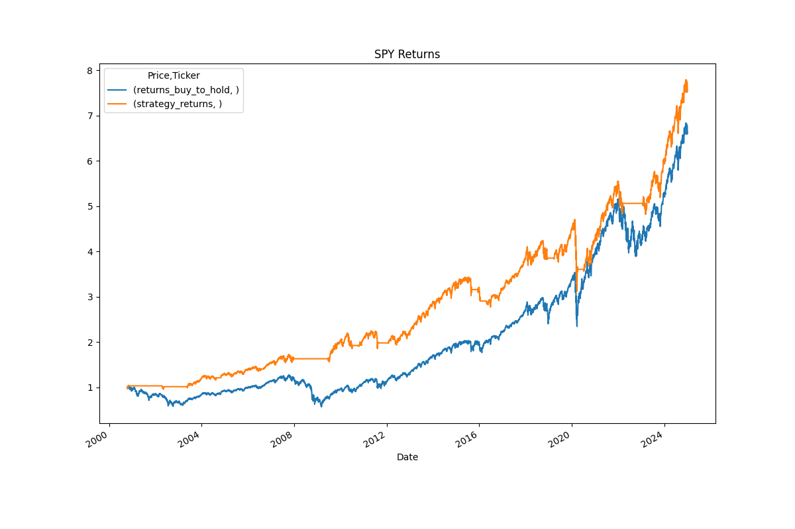

## Design

Quantative trading has always fascinated me after reading the _"The Quants"_ my freshman year. BullRun is my first successful attempt at creating a python-based trading algorithm.

The program is simple & straightforward - the algorithm either holds a long position if the SMA (Short-term Moving Average) is above the LMA (Long-term Moving Average), and sells if otherwise. To build this, I utlized Python libraries such as Pandas, Matplotlib, and yfinance to pull historical data, store in a easily-manipulatable format, and calculate the backtested returns of my strategy. I created a class of functions to easily allow me to test this strategy on several different tickers and time periods.

Overall, I decided to simply trade the SPY. While backtesting, I found that trading individual stocks was more volatile and a risk I was uncomfortable with taking. By trading the SPY, it minimizes that volatility while still allowing me to go long on wider market trends.

By focusing on the larger market and buying these "trends" when the SMA overlapped the LMA, this simple strategy would have outreturned a buy-and-hold strategy of the SPY.

## Implementation

After completing the backtesting phase, I was eager to see how my strategy would perform in the real market. To make that happen, I decided to deploy my trading algorithm using Alpaca's paper trading platform. This allowed me to simulate live trading without any financial risk. I integrated Alpaca’s API, which not only lets me access daily data updates but also enables me to automatically send buy and sell orders based on the signals generated by my strategy. I am excited to see how my strategy will fair this year. 

## How To Improve

BullRun has been a great learning experience for me in the world of quantitative trading, and I'm looking forward to using it as a starting point to dive deeper into the field and keep improving my skills.

I plan to enhance BullRun by adding more robust features aimed at improving returns while minimizing risk. One such improvement is the introduction of a "stop-loss" feature, which automatically sells a stock if it experiences a market correction not fully reflected in the moving averages. Another enhancement involves adjusting position sizing for long positions based on the phase and size of the trend. For example, as the trend progresses, I want to gradually sell off more of my holdings in preparation for a potential mean reversion.

After upgrading BullRun, I plan on moving my attention to other, more sophisticated trading strategies, like mean reversion, price arbitrage, and high-frequency trading.

